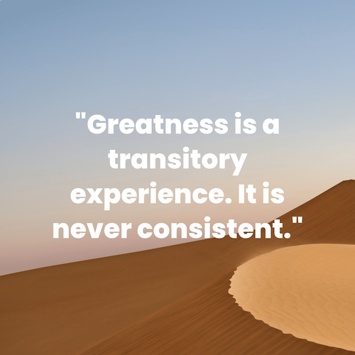

<p align="center"> 
  
</p>
<h1 align="center">Dune Project</h1>

Dune project is an automated way to publish Dune Quote artwork on Redbubble with recommended size and resolution.


## How it works?
The script will send a `GET` request to [Dune API](https://github.com/ywalia01/dune-api).

We will get a random quote from Dune Movies.

Then, it will send this quote to [Bruzu API](https://docs.bruzu.com/), an image generator.

After that, you will find your image in the root folder of the project.


## Installation
```bash
# Install
npm install

# Import Tailwind
npm tailwind:css

# Start project
npm start
```

**IMPORTANT** : You have to create a `.env` file and see the example from `.env.example`. You have to fill in with your API keys. 

```
API_KEY_BRUZU=YOUR-BRUZU-API-KEY
```


## Usage
Go to `localhost:3000/quote` to generate a quote with a beautiful background and cool font 😎

You can modify the Bruzu URL in `routes/quote.js` file, to change fonts, colors, positions...

See Bruzu [Documention](https://docs.bruzu.com/)

```js
axios.get(encodeURI('https://img.bruzu.com/?apiKey='+process.env.API_KEY_BRUZU+'&backgroundImage=https://source.unsplash.com/zuueig1w8WI/7632x6480&h=6480&w=7632&a.text=' + quote + '&a.color=white&a.fontFamily=Poppins&a.fontWeight=800&a.width=7632&a.fs=375&a.ta=center'), {responseType: "stream"} )  
        .then(response => {  
            // Saving file to working directory  
            response.data.pipe(fs.createWriteStream("output.png"));  
        })  
            .catch(error => {  
            console.log(error);  
        }); 
```

➡️ Output file at root : `output.png`


## Example
<p align="center"> 
  
</p>


## Todo
* Add the auto publish on Redbubble
* Add possibility to enter Unsplash URL for background


## Author
Aktilor - 2021
